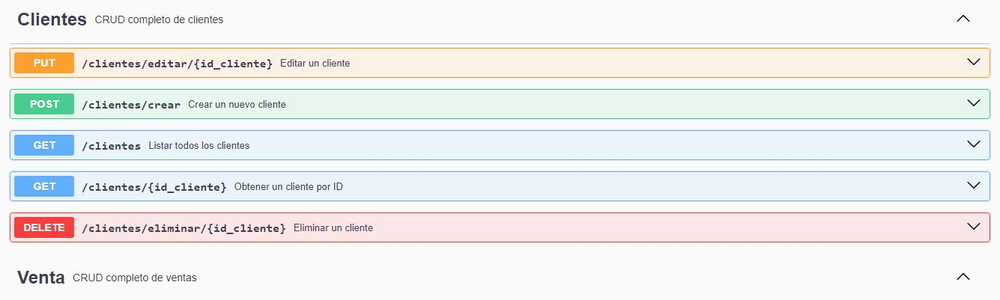

# TP Integrador Final

## 📌 Objetivo

El objetivo de este proyecto integrador final es validar los
conocimientos prácticos y técnicos respecto al desarrollo de APIs en
Java mediante Spring Boot.

------------------------------------------------------------------------

## 📘 Escenario

Un buzar ha incrementado en gran medida sus ventas. Debido a esto, y a
que ya no pueden registrar y manejar el stock de forma manual, necesitan
una aplicación que les permita realizar esta tarea.

La dueña del bazar manifiesta que todas las operaciones de la aplicación
deben poder realizarse mediante dos tipos de clientes HTTP distintos:

-   **Aplicación web** (frontend desarrollado por un programador amigo).
-   **Aplicación mobile** (a implementarse a futuro).

Ambas aplicaciones representan los dispositivos usados actualmente: una
computadora y varios celulares.

Dada esta situación y la necesidad de un backend común, se solicita el
desarrollo de una **API REST**.

------------------------------------------------------------------------

## 🧩 Modelado

A partir del análisis realizado, se determinaron las siguientes clases:

-   `Producto`
-   `Venta`
-   `Cliente`

Cada venta posee:

-   Una lista de productos.
-   Un único cliente asociado.

### 🔹 Atributos de cada clase

------------------------------------------------------------------------

### **Producto**

``` java
Long codigo_producto
String nombre
String marca
Double costo
Double cantidad_disponible
```

------------------------------------------------------------------------

### **Venta**

``` java
Long codigo_venta
LocalDate fecha_venta
Double total
List<Producto> listaProductos
Cliente unCliente
```

------------------------------------------------------------------------

### **Cliente**

``` java
Long id_cliente
String nombre
String apellido
String dni
```

------------------------------------------------------------------------

## ✅ Requerimientos

### **1. CRUD de productos**

**Métodos HTTP:** `GET`, `POST`, `DELETE`, `PUT`

**Endpoints:**

    POST   localhost:8080/productos/crear
    GET    localhost:8080/productos
    GET    localhost:8080/productos/{codigo_producto}
    DELETE localhost:8080/productos/eliminar/{codigo_producto}
    PUT    localhost:8080/productos/editar/{codigo_producto}

------------------------------------------------------------------------

### **2. CRUD de clientes**

**Métodos HTTP:** `GET`, `POST`, `DELETE`, `PUT`

**Endpoints:**

    POST   localhost:8080/clientes/crear
    GET    localhost:8080/clientes
    GET    localhost:8080/clientes/{id_cliente}
    DELETE localhost:8080/clientes/eliminar/{id_cliente}
    PUT    localhost:8080/clientes/editar/{id_cliente}

------------------------------------------------------------------------

### **3. CRUD de ventas**

**Métodos HTTP:** `GET`, `POST`, `DELETE`, `PUT`

**Endpoints:**

    POST   localhost:8080/ventas/crear
    GET    localhost:8080/ventas
    GET    localhost:8080/ventas/{codigo_venta}
    DELETE localhost:8080/clientes/eliminar/{codigo_venta}
    PUT    localhost:8080/clientes/editar/{codigo_venta}

------------------------------------------------------------------------

### **4. Obtener productos con stock menor a 5**

**Método HTTP:** `GET`

    GET localhost:8080/productos/falta_stock

------------------------------------------------------------------------

### **5. Obtener los productos de una venta**

**Método HTTP:** `GET`

    GET localhost:8080/ventas/productos/{codigo_venta}

------------------------------------------------------------------------

### **6. Obtener sumatoria del monto y cantidad total de ventas por día**

**Método HTTP:** `GET`

    GET localhost:8080/ventas/{fecha_venta}

------------------------------------------------------------------------

### **7. Obtener la venta con el monto más alto**

Debe retornar:

-   `codigo_venta`
-   `total`
-   `cantidad de productos`
-   `nombre del cliente`
-   `apellido del cliente`

**Método HTTP:** `GET`

    GET localhost:8080/ventas/mayor_venta

------------------------------------------------------------------------

###  ** Json para probar **

**Crear un proucto**

Post http://localhost:8080/productos/crear
     
     {
 
  "codigo_producto": 101,
  "nombre": "Laptop Lenovo",
  "marca": "Lenovo",
  "costo": 2500000.0,
  "cantidad_disponible": 15
 
 }

{  
      "codigo_producto": 102,
      "nombre": "Mouse Logitech",
      "marca": "Logitech",
      "costo": 100000.0,
      "cantidad_disponible": 30

}

**Crear clientes clientes**
post http://localhost:8080/clientes/crear
{
  "nombre": "Carlos",
  "apellido": "Ramírez",
  "dni": "1001234567"
}

**Crear Ventas**

post http://localhost:8080/ventas/crear
{
  "codigo_venta": 5001,
  "fechaVenta": "2025-01-15",
  "total": 3500000.0,
  "listaProductos": [
    {
      "codigo_producto": 101,
      "nombre": "Laptop Lenovo",
      "marca": "Lenovo",
      "costo": 2500000.0,
      "cantidad_disponible": 15
    },
    {
      "codigo_producto": 102,
      "nombre": "Mouse Logitech",
      "marca": "Logitech",
      "costo": 100000.0,
      "cantidad_disponible": 30
    }
  ],
  "unCliente": {
    "id_cliente": 1,
    "nombre": "Carlos",
    "apellido": "Ramírez",
    "dni": "1001234567"
  }
}

**trar clientes**

 Get http://localhost:8080/clientes/1

 **Editar un cliente**

 
{
  "nombre": "jhonatan",
  "apellido": "Ramírez",
  "dni": "1001234567"
}

 **Producto con falta de Stock**

 GEt http://localhost:8080/productos/falta_stock


**Buscar productos por codigo**
get http://localhost:8080/ventas/productos/5001


**Venta mayor**

get http://localhost:8080/ventas/mayor_venta

**buscar por fecha**

http://localhost:8080/ventas/fecha/2025-01-15


**Visualizar con Swagger**

http://localhost:8080/swagger-ui/index.html



